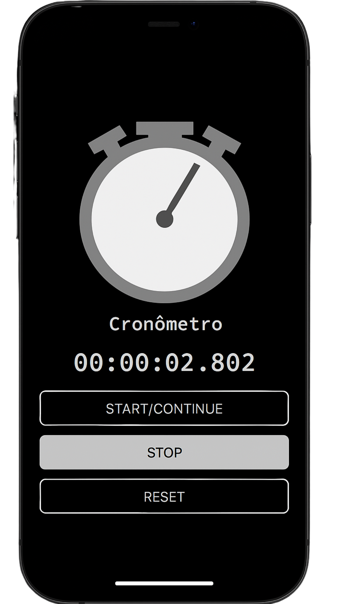

# ⏱️ Cronômetro JS Responsivo

Este é um projeto simples de cronômetro feito com HTML, CSS e JavaScript, criado para praticar o uso das funções setInterval e clearInterval para controlar a contagem do tempo.
O layout é moderno, limpo e também responsivo para diferentes tamanhos de tela.

---

## 📱 Versão Responsiva (Mobile)  
Visualização adaptada para celulares:  

Cronômetro em celular com layout ajustado e botões grandes  

  

---

## 🛠️ Tecnologias Utilizadas  
HTML5  
CSS3  
JavaScript  

---

Você pode visualizar meu projeto em:  
https://adriciachiarini.github.io/cronometro-js
